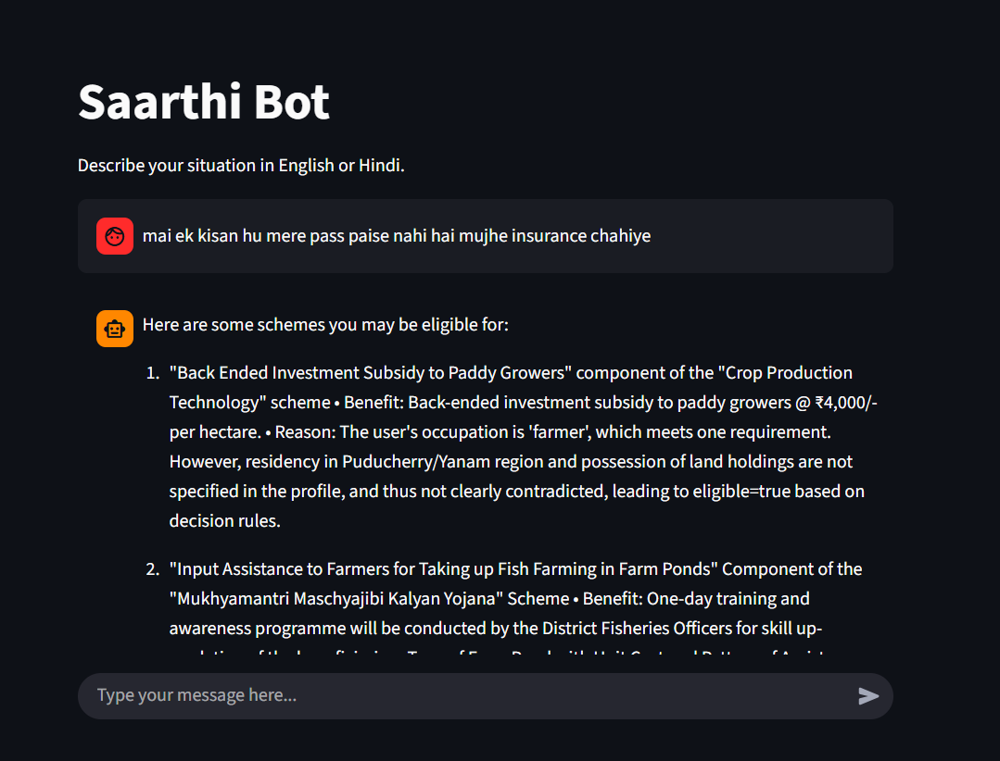
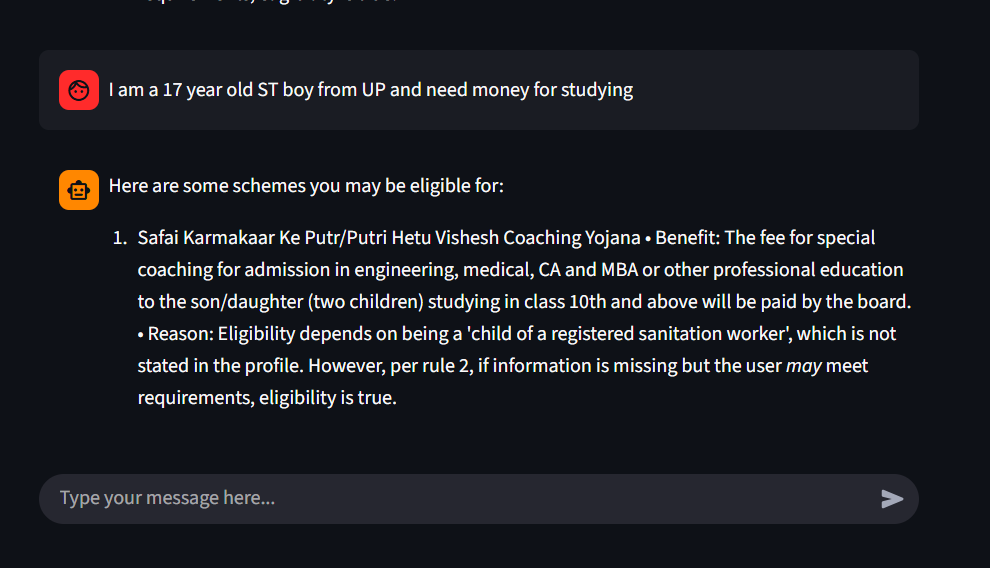

# 🏛️ Saarthi Bot : AI powered government scheme analyzer 

An AI-powered assistant that helps the underprivilaged discover Indian government welfare schemes they may be eligible for, using **natural language queries in Hindi/English/Hinglish**.

---

## 📌 Problem Statement

Many government welfare schemes in India fail to reach their intended beneficiaries due to lack of awareness, language barriers, and complex eligibility criteria. Farmers and students often do not know which schemes apply to them or how to begin the application process.

---

## 💡 Solution Overview

This project uses **Artificial Intelligence (LLMs)** to understand user queries, extract relevant details (age, occupation, category, state, intent), and match them with suitable government schemes from a structured dataset.  
The system prioritizes **inclusive discovery** instead of rigid rejection, ensuring users are guided even when some information is missing.

---

## 🧠 Key Features

- ✅ Natural language understanding (Hindi + English)
- 🌾 Farmer-focused schemes (insurance, subsidies, welfare)
- 🎓 Student-focused schemes (scholarships, education support)
- 🤖 AI-based entity extraction & eligibility reasoning
- 🧾 Clear explanation of benefits and eligibility
- 🔒 Safe fallback logic to avoid false negatives

---

## 🖼️ Screenshots

### User Input Example

### More Examples

---

## 🛠️ Tech Stack

- **Backend:** FastAPI (Python)
- **AI / NLP:** Google Gemini API
- **Data Processing:** Rule-based filtering + AI reasoning
- **Frontend :** Streamlit
- **Dataset:** Structured Indian Government Schemes dataset (cleaned and converted to JSON)

---